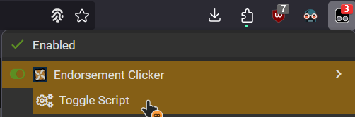

# Fallen's UserScripts

## Table of Contents

- [About](#about)
- [Getting Started](#getting_started)
- [Installing](#installing)
- [Usage](#usage)
    -[Nexus_Auto_Endorse](#script_nexus_endorse)

## About 

Some userscripts I made

### Prerequisites

Get the tampermonkey extension for your browser : [TamperMonkey](https://www.tampermonkey.net/)

### Installing 

Click on the links here to install the scripts :

* [Nexus Mod Auto Endorse](https://github.com/FallenStar08/FallenUserScripts/raw/main/NexusAutoEndorse.user.js)

### Usage 

* # NexusMod Auto Endorse 
Go to your nexus download history and click 